---
## Front matter
title: "Отчёт по лабораторной работе № 2"
subtitle: "Архитектура компьюьера"
author: "Андреева Софья Владимировна"

## Generic otions
lang: ru-RU
toc-title: "Содержание"

## Bibliography
bibliography: bib/cite.bib
csl: pandoc/csl/gost-r-7-0-5-2008-numeric.csl

## Pdf output format
toc: true # Table of contents
toc-depth: 2
lof: true # List of figures
fontsize: 12pt
linestretch: 1.5
papersize: a4
documentclass: scrreprt
## I18n polyglossia
polyglossia-lang:
  name: russian
  options:
	- spelling=modern
	- babelshorthands=true
polyglossia-otherlangs:
  name: english
## I18n babel
babel-lang: russian
babel-otherlangs: english
## Fonts
mainfont: PT Serif
romanfont: PT Serif
sansfont: PT Sans
monofont: PT Mono
mainfontoptions: Ligatures=TeX
romanfontoptions: Ligatures=TeX
sansfontoptions: Ligatures=TeX,Scale=MatchLowercase
monofontoptions: Scale=MatchLowercase,Scale=0.9
## Biblatex
biblatex: true
biblio-style: "gost-numeric"
biblatexoptions:
  - parentracker=true
  - backend=biber
  - hyperref=auto
  - language=auto
  - autolang=other*
  - citestyle=gost-numeric
## Pandoc-crossref LaTeX customization
figureTitle: "Рис."
listingTitle: "Листинг"
lofTitle: "Список иллюстраций"
lotTitle: "Список таблиц"
lolTitle: "Листинги"
## Misc options
indent: true
header-includes:
  - \usepackage{indentfirst}
  - \usepackage{float} # keep figures where there are in the text
  - \floatplacement{figure}{H} # keep figures where there are in the text
---

# Цель работы

Целью работы является изучить идеологию и применение средств контроля версий.
Приобрести практические навыки по работе с системой git.

# Выполнение лабораторной работы

## Настройка github.

Для начала я создала учетную запись на сайте https://github.com/ и заполнила
основные данные (рис. @fig:001).

{#fig:001 width=70%}

## Базовая настройка git.

Сначала сделаем предварительную конфигурацию git. Откроtv терминал и введем
следующие команды, указав имя и email владельца репозитория (рис. @fig:002).

{#fig:002 width=70%}

Настроим utf-8 в выводе сообщений git(рис. @fig:003).

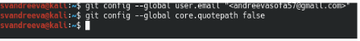{#fig:003 width=70%}

Зададим имя начальной ветки (master), параметр autocrlf и параметр safecrlf (рис. @fig:004).

{#fig:004 width=70%}

## Создание SSH ключа.

Для последующей идентификации пользователя на сервере репозиториев сгенерируем пару ключей (рис. @fig:005).

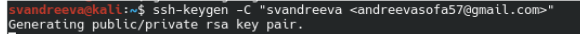{#fig:005 width=70%}

Далее дважды нажимаем на клавишу Enter (рис. @fig:006).

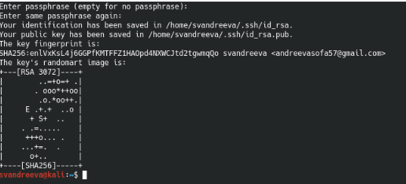{#fig:006 width=70%}

Воспользуемся командой cat ~/.ssh/id_rsa.pub , чтобы можно было скопировать ключ и добавить его на github (рис. @fig:007).

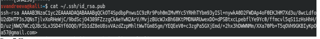{#fig:007 width=70%}

Далее необходимо загрузить сгенерированный открытый ключ. Для этого зайдем на сайт github под своей учётной записью, перейдем в меню Setting. После этого выберем в боковом меню SSH and GPG keys и нажмем на кнопку New SSH key.Затем вставляем скопированный ключ в появившееся на сайте поле и указываем для ключа имя (рис. @fig:008).

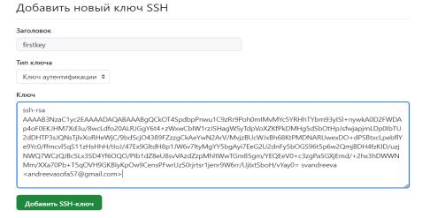{#fig:008 width=70%}

## Создание рабочего пространства и репозитория курса на основе шаблона.

При выполнении лабораторных работ будем придерживаться структуры рабочего пространства.Откроем терминал и создим каталог для предмета «Архитектура компьютера» (рис. @fig:009).

{#fig:009 width=70%}

## Создание репозитория курса на основе шаблона.

Создадим репозиторий на основе шаблона через web-интерфейс github. Перейдем на страницу репозитория с шаблоном курса и далее выберем Use this template.Зададим имя репозитория study_2023–2024_arhpc и создадим репозиторий (рис. @fig:010).

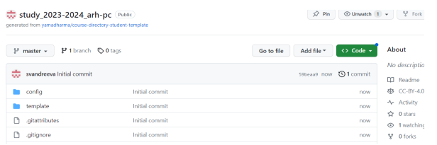{#fig:010 width=70%}

Перейдем в каталог курса.Клонируем созданный репозиторий, скопировав ссылку на странице созданного репозитория Code -> SSH (рис. @fig:011).

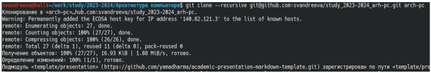{#fig:011 width=70%}

## Настройка каталога курса.

Перейдем в каталог курса и удалим лишние файлы (рис. @fig:012).

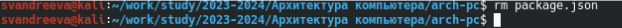{#fig:012 width=70%}

Создадим необходимые каталоги и отправим файлы на сервер (рис. @fig:013).

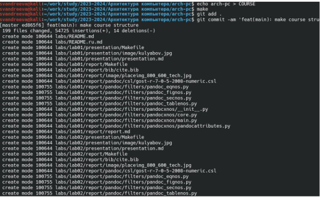{#fig:013 width=70%}

Проверим правильность создания иерархии рабочего пространства в локальном репозитории (рис. @fig:014).

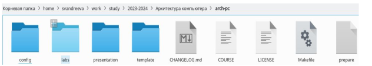{#fig:014 width=70%}

# Выполнение заданий для самостоятельной работы.

Создадим отчет по выполнению лабораторной работы в соответствующем каталоге рабочего пространства (рис. @fig:015).

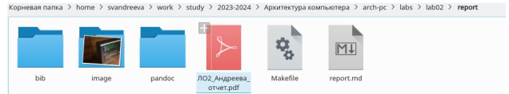{#fig:015 width=70%}

Скопируем отчеты по выполнению предыдущей лабораторной работе в соответствующий каталог (рис. @fig:016).

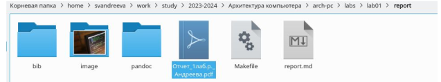{#fig:016 width=70%}

Загрузим файлы на github (рис. @fig:017).

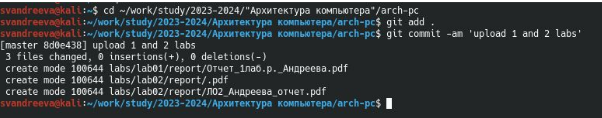{#fig:017 width=70%}

# Выводы

Мы изучили идеологию и применение средств контроля версий и приобрели навыки по работе с системой git, мы зарегестрировались на github, провели базовую настройку git, создали SSH-ключ, создали рабочее пространство и репозиторий курса, настроили его каталог и научились загружать на него файлы.

