---
## Front matter
title: "Отчёт по лабораторной работе №3"
subtitle: "Архитектура компьютера"
author: "Андреева Софья Владимировна"

## Generic otions
lang: ru-RU
toc-title: "Содержание"

## Bibliography
bibliography: bib/cite.bib
csl: pandoc/csl/gost-r-7-0-5-2008-numeric.csl

## Pdf output format
toc: true # Table of contents
toc-depth: 2
lof: true # List of figures
fontsize: 12pt
linestretch: 1.5
papersize: a4
documentclass: scrreprt
## I18n polyglossia
polyglossia-lang:
  name: russian
  options:
	- spelling=modern
	- babelshorthands=true
polyglossia-otherlangs:
  name: english
## I18n babel
babel-lang: russian
babel-otherlangs: english
## Fonts
mainfont: PT Serif
romanfont: PT Serif
sansfont: PT Sans
monofont: PT Mono
mainfontoptions: Ligatures=TeX
romanfontoptions: Ligatures=TeX
sansfontoptions: Ligatures=TeX,Scale=MatchLowercase
monofontoptions: Scale=MatchLowercase,Scale=0.9
## Biblatex
biblatex: true
biblio-style: "gost-numeric"
biblatexoptions:
  - parentracker=true
  - backend=biber
  - hyperref=auto
  - language=auto
  - autolang=other*
  - citestyle=gost-numeric
## Pandoc-crossref LaTeX customization
figureTitle: "Рис."
tableTitle: "Таблица"
listingTitle: "Листинг"
lofTitle: "Список иллюстраций"
lolTitle: "Листинги"
## Misc options
indent: true
header-includes:
  - \usepackage{indentfirst}
  - \usepackage{float} # keep figures where there are in the text
  - \floatplacement{figure}{H} # keep figures where there are in the text
---

# Цель работы

Целью работы является освоение процедуры оформления отчетов с помощью легковесного
языка разметки Markdown.

# Выполнение лабораторной работы

Откроем терминал и перейдем в каталог курса сформированный при выполнении лабораторной работы
№2 и обновим локальный репозиторий, скачав изменения из удаленного репозитория (рис. @fig:001).

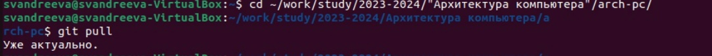{#fig:001 width=70%}

 Перейдем в каталог с шаблоном отчета по лабораторной работе № 3 и проведем компиляцию шаблона с использованием Makefile (рис. @fig:002).
 
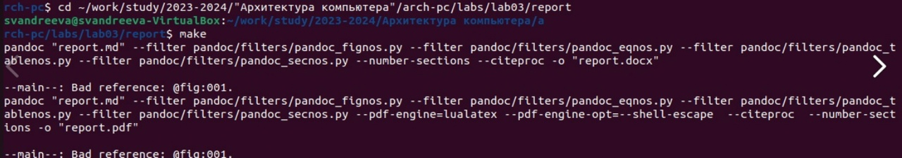{#fig:002 width=70%}

При успешной компиляции должны сгенерироваться файлы report.pdf и report.docx.
Откроем и проверим корректность полученных файлов.Все прошло корректно(рис. @fig:003).

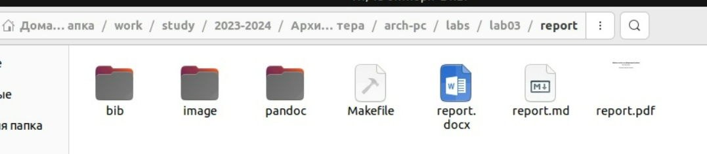{#fig:003 width=70%}

Удалим полученный файлы с использованием Makefile (рис. @fig:004).

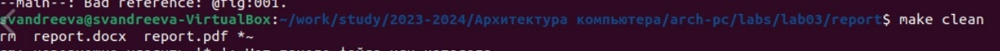{#fig:004 width=70%}

Проверим, что после этой команды файлы report.pdf и report.docx были удалены (рис. @fig:005).

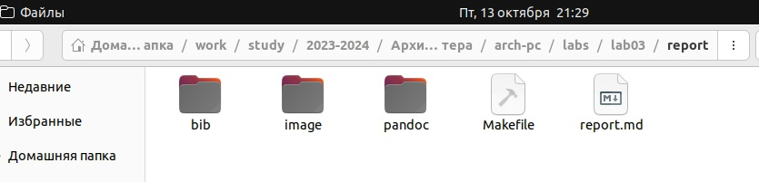{#fig:005 width=70%}

 Откроем файл report.md c помощью текстового редактора gedit и внимательно изучим структуру этого файла (рис. @fig:006).
 
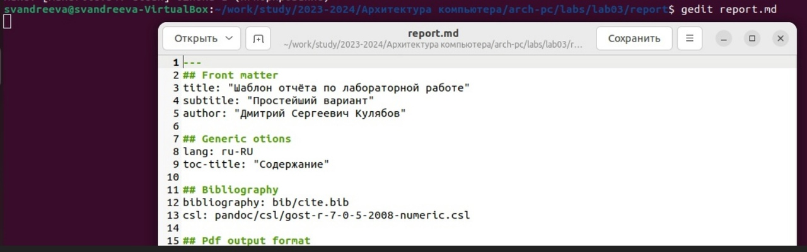{#fig:006 width=70%}

Заполним отчет.Описывая свои действия, правильно прикрепляем скриншоты,они должны быть размещены в каталоге image (рис. @fig:007).

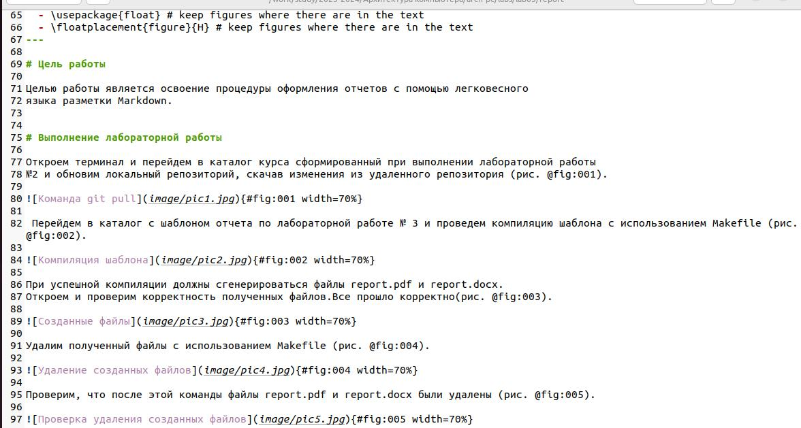{#fig:007 width=70%}

Скомпилируем отчет с использованием Makefile. Проверим корректность полученных файлов (рис. @fig:008) (рис. @fig:009).

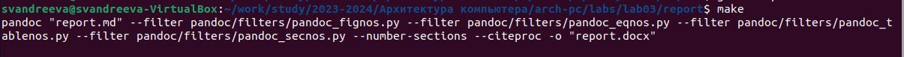{#fig:008 width=70%}

{#fig:009 width=70%}

Загрузим файлы на Github(рис. @fig:010) . 

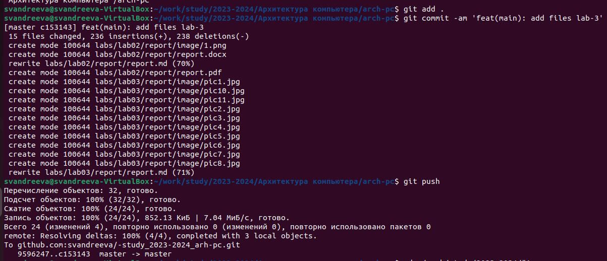{#fig:010 width=70%}

# Задание для самостоятельной работы.

В соответствующем каталоге сделаем отчёт по лабораторной работе № 2 в формате Markdown.Для этого переходим в соответствующий каталог и открываем текстовый редактор (рис. @fig:011).

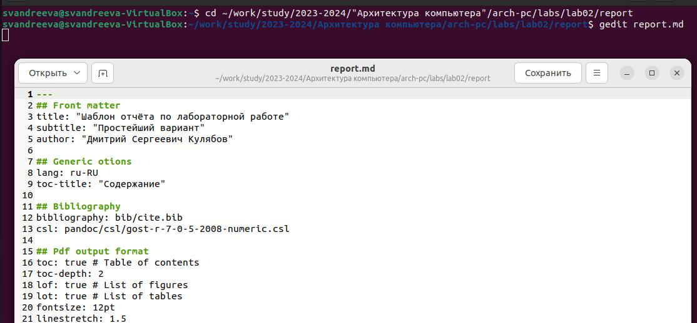{#fig:011 width=70%}

Заполним отчет,скомпилируем его (рис. @fig:012) (рис. @fig:013).

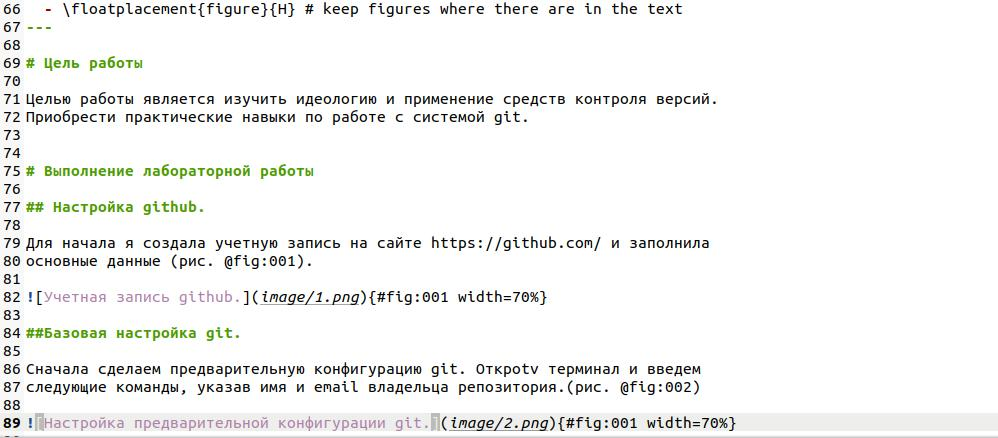{#fig:012 width=70%}

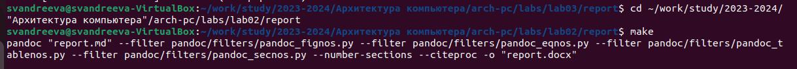{#fig:013 width=70%}

Загрузим файлы на Github с помощью команд                                                                                         git add .                                                                                                                          git commit -am 'feat(main): add files lab-2'                                                                                      git push                                                                                                                          И проверим их наличие на странице репозитория(рис. @fig:014).

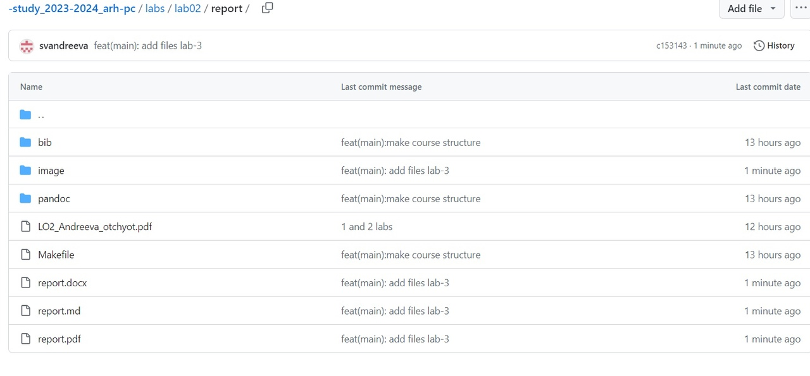{#fig:014 width=70%}
 
# Выводы

Я научилась оформлять отчеты с помощью легковесного
языка разметки Markdown.

