---
## Front matter
title: "Отчёт по лабораторной работе №4"
subtitle: "Архитектура компьютера"
author: "Андреева Софья Владимировна"

## Generic otions
lang: ru-RU
toc-title: "Содержание"

## Bibliography
bibliography: bib/cite.bib
csl: pandoc/csl/gost-r-7-0-5-2008-numeric.csl

## Pdf output format
toc: true # Table of contents
toc-depth: 2
lof: true # List of figures
fontsize: 12pt
linestretch: 1.5
papersize: a4
documentclass: scrreprt
## I18n polyglossia
polyglossia-lang:
  name: russian
  options:
	- spelling=modern
	- babelshorthands=true
polyglossia-otherlangs:
  name: english
## I18n babel
babel-lang: russian
babel-otherlangs: english
## Fonts
mainfont: PT Serif
romanfont: PT Serif
sansfont: PT Sans
monofont: PT Mono
mainfontoptions: Ligatures=TeX
romanfontoptions: Ligatures=TeX
sansfontoptions: Ligatures=TeX,Scale=MatchLowercase
monofontoptions: Scale=MatchLowercase,Scale=0.9
## Biblatex
biblatex: true
biblio-style: "gost-numeric"
biblatexoptions:
  - parentracker=true
  - backend=biber
  - hyperref=auto
  - language=auto
  - autolang=other*
  - citestyle=gost-numeric
## Pandoc-crossref LaTeX customization
figureTitle: "Рис."
tableTitle: "Таблица"
listingTitle: "Листинг"
lofTitle: "Список иллюстраций"
lolTitle: "Листинги"
## Misc options
indent: true
header-includes:
  - \usepackage{indentfirst}
  - \usepackage{float} # keep figures where there are in the text
  - \floatplacement{figure}{H} # keep figures where there are in the text
---

# Цель работы

Освоение процедуры компиляции и сборки программ, написанных на ассемблере NASM

# Выполнение лабораторной работы

## Программа Hello world! 

Создадим каталог для работы с программами на языке ассемблера NASM,перейдем в него.Создадим текстовый файл с именем hello.asm и откроем его с помощью gedit (рис. @fig:001).

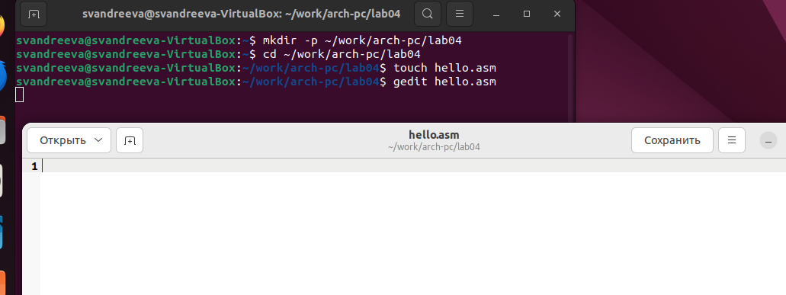{#fig:001 width=70%}

Введем следующий текст (рис. @fig:002).
 
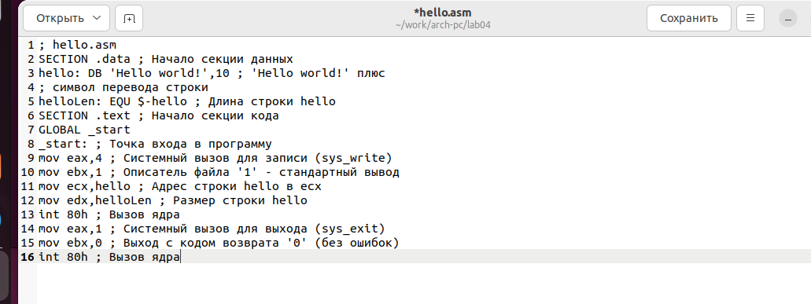{#fig:002 width=70%}

## Транслятор NASM

С помощью транслятора преобразуем текст программы из файла hello.asm в объектный код, который запишется в файл hello.o.С помощью команды ls проверим, что объектный файл был создан.Объектный файл называется hello.o(рис. @fig:003).

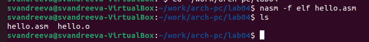{#fig:003 width=70%}

## Расширенный синтаксис командной строки NASM

Скомпилируем исходный файл hello.asm в obj.o, при этом формат выходного файла будет elf, и в него будут включены символы для отладки , кроме того, будет создан файл листинга list.lst. С помощью команды ls проверим, что файлы были созданы (рис. @fig:004).

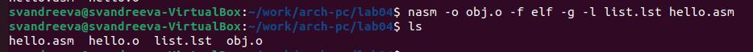{#fig:004 width=70%}

## Компоновщик LD.

Передадим на обработку компоновщику объектный файл. С помощью команды ls проверим, что исполняемый файл hello был создан (рис. @fig:005).

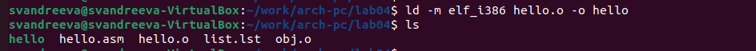{#fig:005 width=70%}

Выполним следующую команду.Исполняемый файл будет иметь имя main. Объектный файл, из которого собран этот исполняемый файл, будет иметь имя main.о (рис. @fig:006).
 
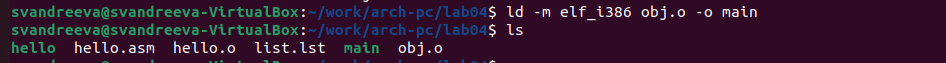{#fig:006 width=70%}

Формат командной строки LD можно увидеть, набрав ld —help (рис. @fig:007).

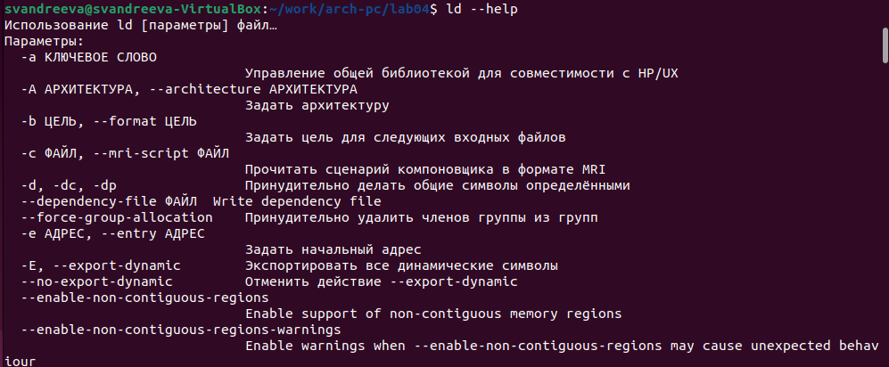{#fig:007 width=70%}

## Запуск исполняемого файла.

Запустим исполняемый файл (рис. @fig:008).

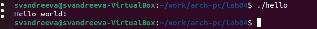{#fig:008 width=70%}

# Задание для самостоятельной работы.

В каталоге ~/work/arch-pc/lab04 с помощью команды cp создадим копию файла hello.asm с именем lab4.asm (рис. @fig:009).

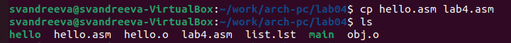{#fig:009 width=70%}

С помощью любого текстового редактора внесем изменения в текст программы в файле lab4.asm так, чтобы вместо Hello world! на экран выводилась строка с моей фамилией и именем. (рис. @fig:010).

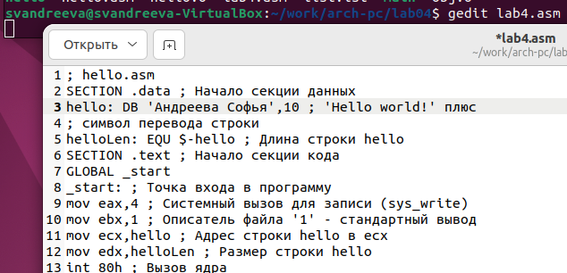{#fig:010 width=70%}

Оттранслирем полученный текст программы lab4.asm в объектный файл. Выполним компоновку объектного файла и запустим получившийся исполняемый файл. (рис. @fig:011).

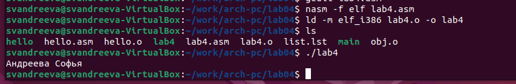{#fig:011 width=70%}

Скопируем файлы hello.asm и lab4.asm в наш локальный репозиторий в каталог ~/work/study/2023-2024/"Архитектура компьютера"/arch-pc/labs/lab04/. Загрузите файлы на Github.(рис. @fig:012).

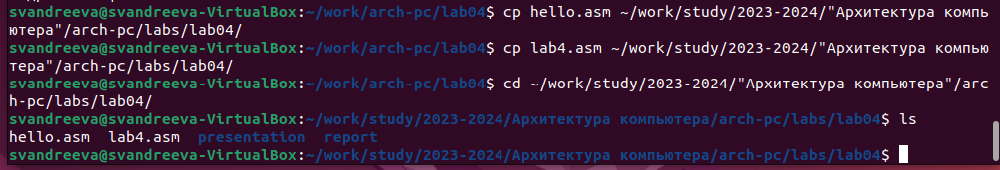{#fig:012 width=70%}
 
Загрузим файлы на Github (рис. @fig:013).
 
{#fig:013 width=70%}
 
# Выводы

В ходе лабораторной работы были освоены процедуры компиляции и сборки программ, написанных на машинноориентированном языке низкого уровня, ассемблере NASM.

