---
## Front matter
title: "Отчёт по лабораторной работе №5"
subtitle: "Архитектура компьютера"
author: "Андреева Софья Владимировна"

## Generic otions
lang: ru-RU
toc-title: "Содержание"

## Bibliography
bibliography: bib/cite.bib
csl: pandoc/csl/gost-r-7-0-5-2008-numeric.csl

## Pdf output format
toc: true # Table of contents
toc-depth: 2
lof: true # List of figures
fontsize: 12pt
linestretch: 1.5
papersize: a4
documentclass: scrreprt
## I18n polyglossia
polyglossia-lang:
  name: russian
  options:
	- spelling=modern
	- babelshorthands=true
polyglossia-otherlangs:
  name: english
## I18n babel
babel-lang: russian
babel-otherlangs: english
## Fonts
mainfont: PT Serif
romanfont: PT Serif
sansfont: PT Sans
monofont: PT Mono
mainfontoptions: Ligatures=TeX
romanfontoptions: Ligatures=TeX
sansfontoptions: Ligatures=TeX,Scale=MatchLowercase
monofontoptions: Scale=MatchLowercase,Scale=0.9
## Biblatex
biblatex: true
biblio-style: "gost-numeric"
biblatexoptions:
  - parentracker=true
  - backend=biber
  - hyperref=auto
  - language=auto
  - autolang=other*
  - citestyle=gost-numeric
## Pandoc-crossref LaTeX customization
figureTitle: "Рис."
tableTitle: "Таблица"
listingTitle: "Листинг"
lofTitle: "Список иллюстраций"
lolTitle: "Листинги"
## Misc options
indent: true
header-includes:
  - \usepackage{indentfirst}
  - \usepackage{float} # keep figures where there are in the text
  - \floatplacement{figure}{H} # keep figures where there are in the text
---

# Цель работы

Приобретение практических навыков работы в Midnight Commander. Освоение инструкций языка ассемблера mov и int.

# Выполнение лабораторной работы

Откроем Midnight Commander.(рис. @fig:001).

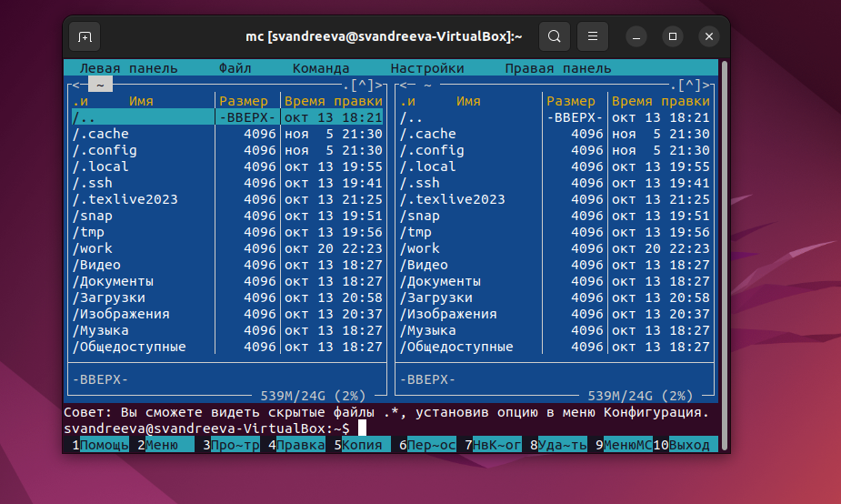{#fig:001 width=70%}

Пользуясь клавишами перейдем в каталог ~/work/arch-pc созданный при выполнении лабораторной работы №4 и с помощью функциональной клавиши F7 создадим папку lab05(рис. @fig:002).
 
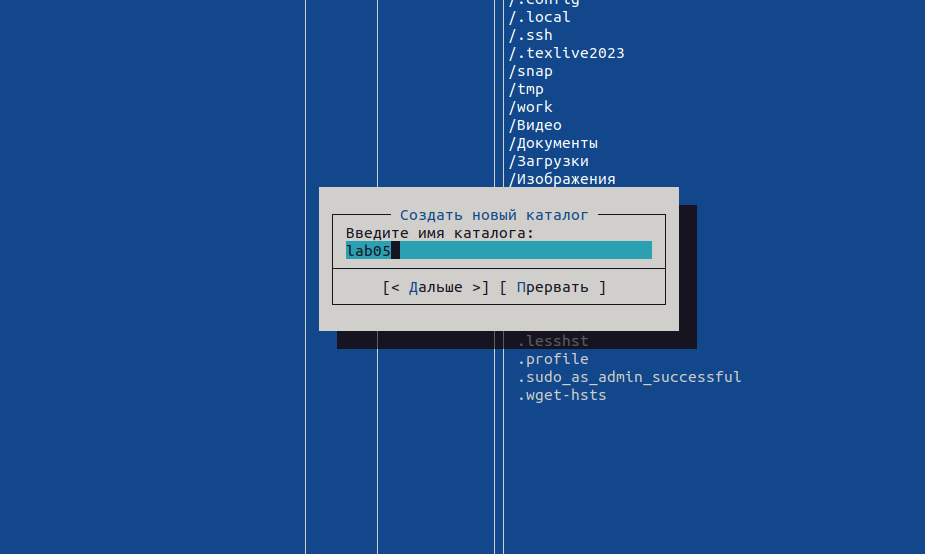{#fig:002 width=70%}

Перейдем в созданный каталог.Пользуясь строкой ввода и командой touch создадим файл lab5-1.asm(рис. @fig:003).

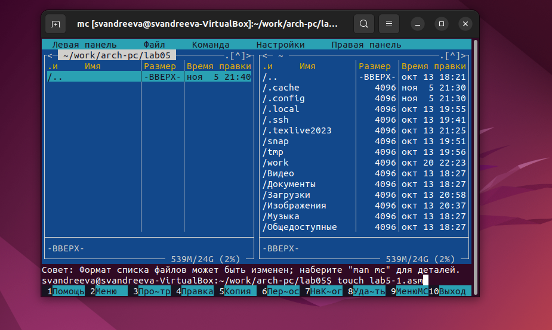{#fig:003 width=70%}

С помощью функциональной клавиши F4 откроем файл lab5-1.asm для редактирования во встроенном редакторе,используем редактор nano.Введем текст программы из листинга, сохраним изменения и закройте файл.С помощью функциональной клавиши F3 открыли файл lab5-1.asm для просмотра и убедились, что файл содержит текст программы (рис. @fig:004).

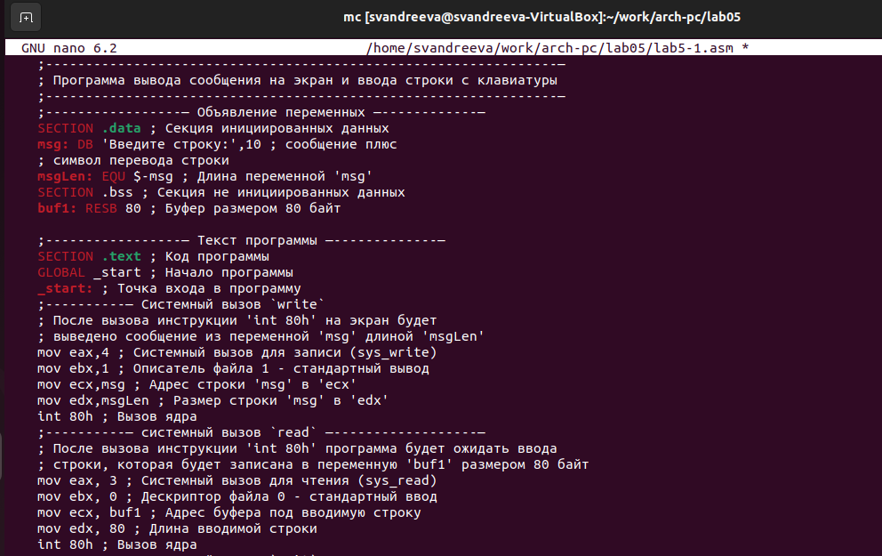{#fig:004 width=70%}

Оттранслируем текст программы lab5-1.asm в объектный файл. Выполним компоновку объектного файла и запустили получившийся исполняемый файл.Программа выводит строку 'Введите строку:' и ожидает ввода с клавиатуры.Вводим туда свое имя и фамилию (рис. @fig:005).

{#fig:005 width=70%}

Скачаем файл in_out.asm со страницы курса в ТУИС. Поместим его в тот же каталог, что и файл с программой, в которой он используется(рис. @fig:006).
 
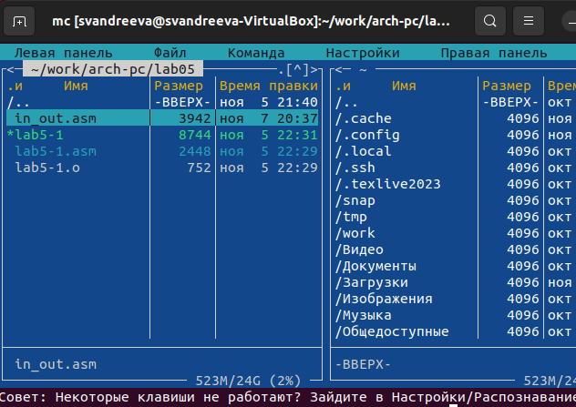{#fig:006 width=70%}

С помощью функциональной клавиши F6 создадим копию файла lab5-1.asm с именем lab5-2.asm. (рис. @fig:007).

{#fig:007 width=70%}

Исправим текст программы в файле lab5-2.asm с использование подпрограмм из внешнего файла in_out.asm в соответствии с листингом (рис. @fig:008).

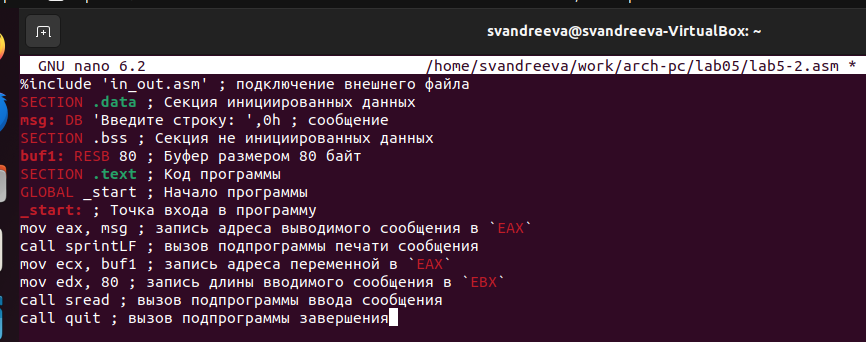{#fig:008 width=70%}

Создадим исполняемый файл и проверим его работу (рис. @fig:009).

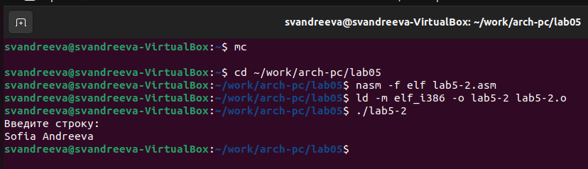{#fig:009 width=70%}

В файле lab5-2.asm замените подпрограмму sprintLF на sprint.Создадим исполняемый файл и проверим его работу.При замене подпрограмм пропадает перенос строки перед вводом текста(рис. @fig:010).

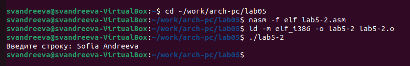{#fig:010 width=70%}

# Задание для самостоятельной работы.

Создадим копию файла lab5-1.asm(рис. @fig:011).

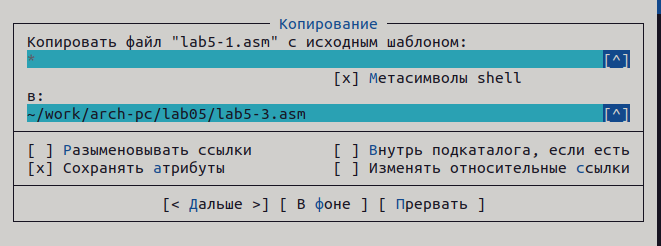{#fig:011 width=70%}

Внесем изменения в программу (без использования внешнего файла in_out.asm), так чтобы она выводила приглашение типа “Введите строку:“ и затем выводила введённую строку на экран.(рис. @fig:012).

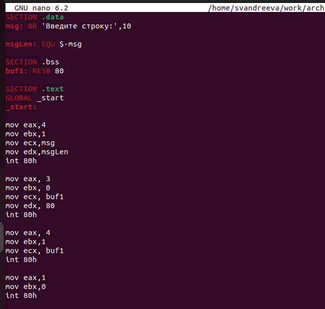{#fig:012 width=70%}

Получим исполняемый файл и проверим его работу.Всё получилось (рис. @fig:013).

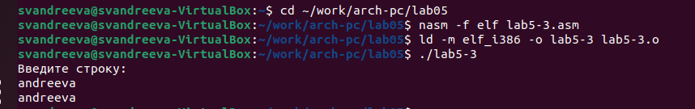{#fig:013 width=70%}

Создадим копию файла lab5-2.asm. Исправим текст программы с использованием подпрограмм из внешнего файла in_out.asm, так чтобы она выводила приглашение типа “Введите строку:“ и затем выводила введённую строку на экран.(рис. @fig:014).

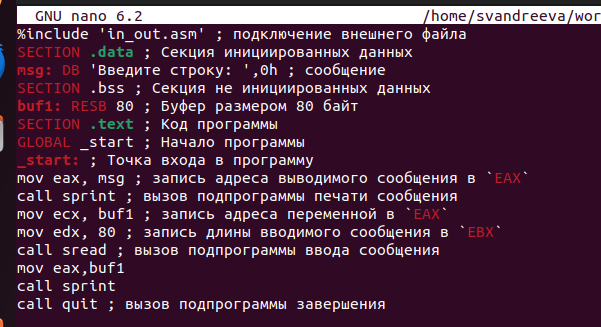{#fig:014 width=70%}
 
Получим исполняемый файл и проверим его работу.Всё получилось(рис. @fig:015).
 
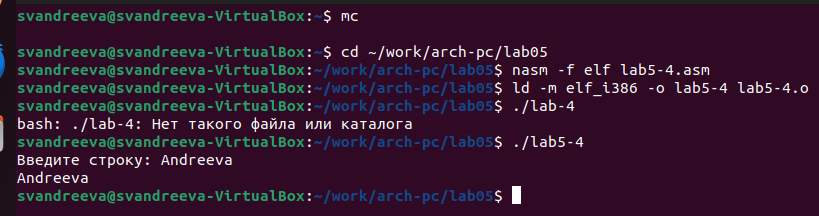{#fig:015 width=70%}
 
# Выводы

Я приобрела практические навыки работы в Midnight Commander и освоенила инструкции языка ассемблера mov и int.
