---
## Front matter
title: "Отчёт по лабораторной работе №6"
subtitle: "Архитектура компьютера"
author: "Андреева Софья Владимировна"

## Generic otions
lang: ru-RU
toc-title: "Содержание"

## Bibliography
bibliography: bib/cite.bib
csl: pandoc/csl/gost-r-7-0-5-2008-numeric.csl

## Pdf output format
toc: true # Table of contents
toc-depth: 2
lof: true # List of figures
fontsize: 12pt
linestretch: 1.5
papersize: a4
documentclass: scrreprt
## I18n polyglossia
polyglossia-lang:
  name: russian
  options:
	- spelling=modern
	- babelshorthands=true
polyglossia-otherlangs:
  name: english
## I18n babel
babel-lang: russian
babel-otherlangs: english
## Fonts
mainfont: PT Serif
romanfont: PT Serif
sansfont: PT Sans
monofont: PT Mono
mainfontoptions: Ligatures=TeX
romanfontoptions: Ligatures=TeX
sansfontoptions: Ligatures=TeX,Scale=MatchLowercase
monofontoptions: Scale=MatchLowercase,Scale=0.9
## Biblatex
biblatex: true
biblio-style: "gost-numeric"
biblatexoptions:
  - parentracker=true
  - backend=biber
  - hyperref=auto
  - language=auto
  - autolang=other*
  - citestyle=gost-numeric
## Pandoc-crossref LaTeX customization
figureTitle: "Рис."
tableTitle: "Таблица"
listingTitle: "Листинг"
lofTitle: "Список иллюстраций"
lolTitle: "Листинги"
## Misc options
indent: true
header-includes:
  - \usepackage{indentfirst}
  - \usepackage{float} # keep figures where there are in the text
  - \floatplacement{figure}{H} # keep figures where there are in the text
---

# Цель работы

Освоение арифметических инструкций языка ассемблера NASM.

# Выполнение лабораторной работы

Создадим каталог для программ лабораторной работы № 6, перейдем в него и создадим файл lab6-1.asm:(рис. @fig:001).

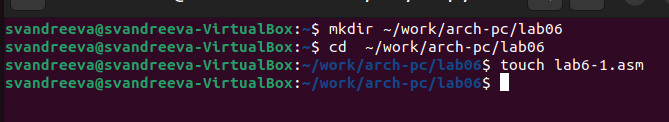{#fig:001 width=70%}

Введем в файл lab6-1.asm текст программы из листинга 6.1.(рис. @fig:002).
 
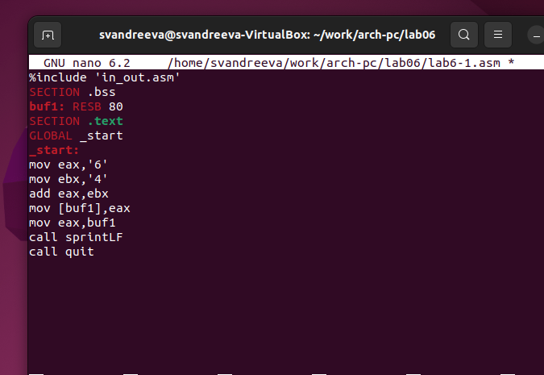{#fig:002 width=70%}

Создадим исполняемый файл и запустим его.В данном случае при выводе значения регистра eax мы ожидаем увидеть число 10. Однако результатом будет символ j. Это происходит потому, что код символа 6 равен 00110110 в двоичном представлении (или 54 в десятичном представлении), а код символа 4 – 00110100(52). Команда add eax,ebx запишет в регистр eax сумму кодов – 01101010 (106), что в свою очередь является кодом символа j(рис. @fig:003).

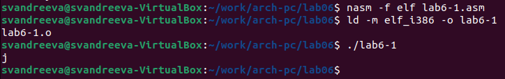{#fig:003 width=70%}

Далее изменим текст программы и вместо символов, запишем в регистры числа. Исправим текст программы следующим образом: заменим строки
mov eax,'6'
mov ebx,'4'
на строки
mov eax,6
mov ebx,4
Создадим исполняемый файл и запустим его.Как и в предыдущем случае при исполнении программы мы не получим число 10.Пользуясь таблицей ASCII определили, что код 10 соответствует символу /n. Это символ перевода строки, он не отображается. (рис. @fig:004).

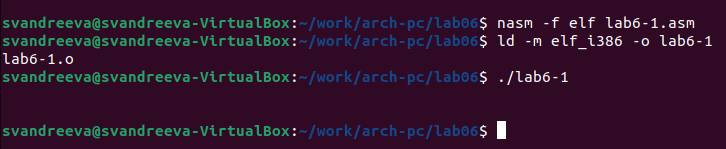{#fig:004 width=70%}

Создадим файл lab6-2.asm и введем в него текст программы из листинга 6.2.Создадим исполняемый файл и запустим его.В результате работы программы мы получим число 106. В данном случае, как и в первом, команда add складывает коды символов ‘6’ и ‘4’ (54+52=106). Однако, в отличии от программыиз листинга 6.1, функция iprintLF позволяет вывести число, а не символ, кодом которого является это число (рис. @fig:005).

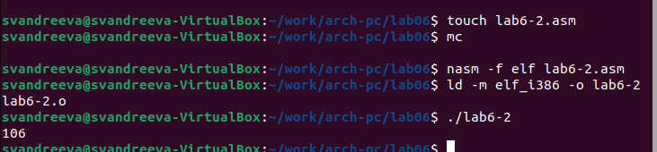{#fig:005 width=70%}

Аналогично предыдущему примеру изменим символы на числа. Заменим строки
mov eax,'6'
mov ebx,'4'
на строки
mov eax,6
mov ebx,4
Создадим исполняемый файл и запустим его.В результате при исполнении программы получили 10.(рис. @fig:006).
 
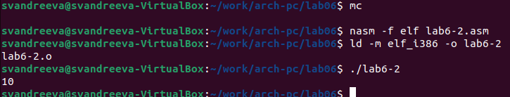{#fig:006 width=70%}

Замените функцию iprintLF на iprint. Создадим исполняемый файл и запустим его. Вывод функций iprintLF и iprint отличается наличием перевода строки после вывода (рис. @fig:007).

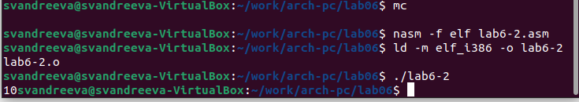{#fig:007 width=70%}

Создадим файл lab6-3.asm в каталоге ~/work/arch-pc/lab06.Внимательно изучите текст программы из листинга 6.3 и введем в lab6-3.asm.Создадим исполняемый файл и запустим его (рис. @fig:008).

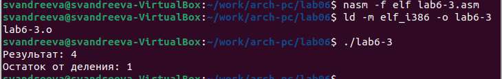{#fig:008 width=70%}

Изменим текст программы для вычисления выражения (4 ∗ 6 + 2)/5. Создадим исполняемый файл и проверим его работу(рис. @fig:009) (рис. @fig:010).

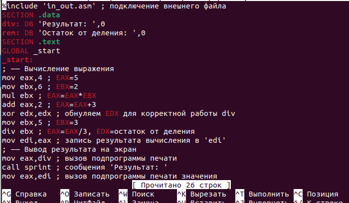{#fig:009 width=70%}

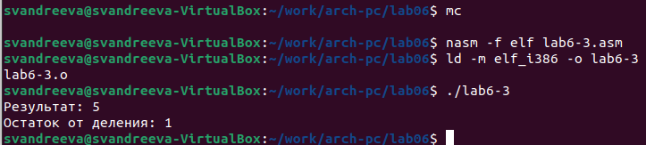{#fig:010 width=70%}

Рассмотрим программу вычисления варианта задания по номеру студенческого билета.Создадим файл variant.asm.Внимательно изучим текст программы из листинга 6.4 и введем в файл variant.asm.Создайте исполняемый файл и запустите его. Проверим результат работы программы вычислив номер варианта аналитически.Всё верно.(рис. @fig:011).

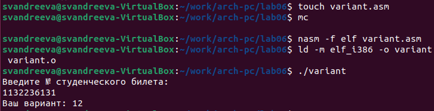{#fig:011 width=70%}

Ответы на вопросы.
1.За вывод на экран сообщения ‘Ваш вариант:',отвечают строки:
mov eax,rem
call sprint
2.Эти инструкции используются для ввода переменной Х(номера студенческого билета) с клавиатуры и сохранения введенных данных.
3.Эта инструкция используется для преобразования Кода переменной ASCII в число.
4.Строки, отвечающие за вычисление варианта:
xor edx,edx
mov ebx,20
div ebx
inc edx 
5.Остаток от деления записывается в регистр edx.
6.Для увеличения значения, полученного при взятии остатка, на 1.
7.Строки, отвечающие за вывод на экран результата вычислений:
mov eax,edx
call iprintLF

# Задание для самостоятельной работы.

Создадим файл var12.asm и напишем в него программу вычисления функции f(x)=(8x-6)/2 (рис. @fig:012).

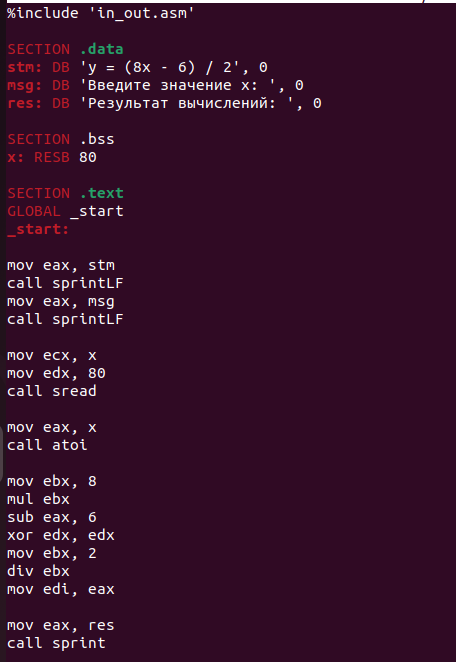{#fig:012 width=70%}

Создадим исполняемый файл и запустим его.Проверим его для значений х=1 и х=5.Все исполнилось корректно.

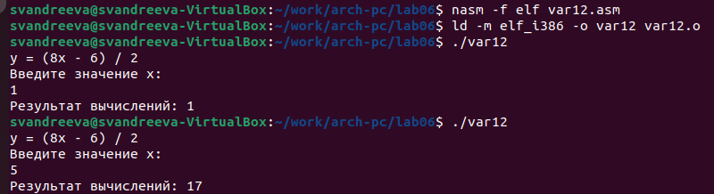{#fig:013 width=70%}
 
# Выводы

Я освоила арифметических инструкций языка ассемблера NASM.
