---
## Front matter
title: "Отчёт по лабораторной работе №7"
subtitle: "Архитектура компьютера"
author: "Андреева Софья Владимировна"

## Generic otions
lang: ru-RU
toc-title: "Содержание"

## Bibliography
bibliography: bib/cite.bib
csl: pandoc/csl/gost-r-7-0-5-2008-numeric.csl

## Pdf output format
toc: true # Table of contents
toc-depth: 2
lof: true # List of figures
fontsize: 12pt
linestretch: 1.5
papersize: a4
documentclass: scrreprt
## I18n polyglossia
polyglossia-lang:
  name: russian
  options:
	- spelling=modern
	- babelshorthands=true
polyglossia-otherlangs:
  name: english
## I18n babel
babel-lang: russian
babel-otherlangs: english
## Fonts
mainfont: PT Serif
romanfont: PT Serif
sansfont: PT Sans
monofont: PT Mono
mainfontoptions: Ligatures=TeX
romanfontoptions: Ligatures=TeX
sansfontoptions: Ligatures=TeX,Scale=MatchLowercase
monofontoptions: Scale=MatchLowercase,Scale=0.9
## Biblatex
biblatex: true
biblio-style: "gost-numeric"
biblatexoptions:
  - parentracker=true
  - backend=biber
  - hyperref=auto
  - language=auto
  - autolang=other*
  - citestyle=gost-numeric
## Pandoc-crossref LaTeX customization
figureTitle: "Рис."
tableTitle: "Таблица"
listingTitle: "Листинг"
lofTitle: "Список иллюстраций"
lolTitle: "Листинги"
## Misc options
indent: true
header-includes:
  - \usepackage{indentfirst}
  - \usepackage{float} # keep figures where there are in the text
  - \floatplacement{figure}{H} # keep figures where there are in the text
---

# Цель работы

Изучение команд условного и безусловного переходов. Приобретение навыков написания программ с использованием переходов. Знакомство с назначением и структурой файла листинга.

# Выполнение лабораторной работы

Создадим каталог для программ лабораторной работы № 7, перейдем в него и создадим файл lab6-7.asm.Введем в файл lab7-1.asm текст программы из листинга 7.1.Создадим исполняемый файл и запустим его. Использование инструкции jmp _label2 меняет порядок исполнения инструкций и позволяет выполнить инструкции начиная с метки _label2, пропустив вывод первого сообщения.(рис. @fig:001).

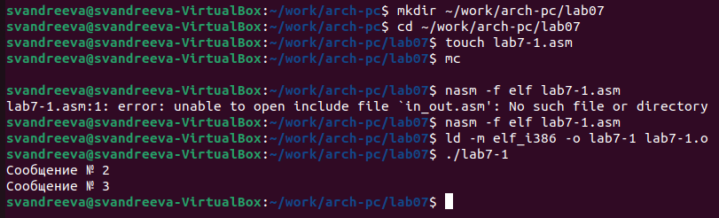{#fig:001 width=70%}

Изменим программу таким образом, чтобы она выводила сначала ‘Сообщение № 2’, потом ‘Сообщение № 1’ и завершала работу. Для этого в текст программы после вывода сообщения № 2 добавим инструкцию jmp с меткой _label1 и после вывода сообщения № 1 добавим инструкцию jmp с меткой _end.Создадим исполняемый файл и проверим его работу(рис. @fig:002).
 
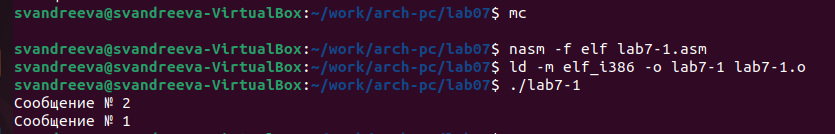{#fig:002 width=70%}

Изменим текст программы (рис. @fig:003), чтобы вывод программы был следующим:
Сообщение № 3
Сообщение № 2
Сообщение № 1

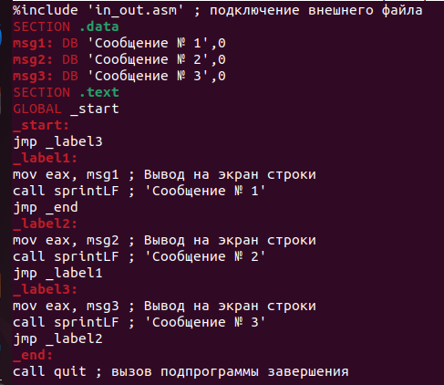{#fig:003 width=70%}

Создадим исполняемый файл и запустим его. Всё получилось (рис. @fig:004).

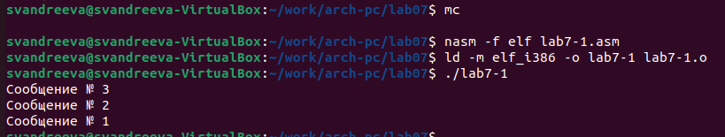{#fig:004 width=70%}

Создадим файл lab7-2.asm в каталоге ~/work/arch-pc/lab07.Внимательно изучим текст программы из листинга 7.3 и введем в lab7-2.asm.Создим исполняемый файл и проверим его работу для разных значений B, я ввела сначала 5, а затем 70.(рис. @fig:005).

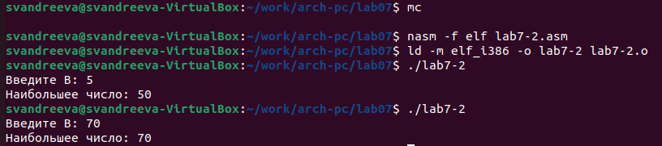{#fig:005 width=70%}

Создадим файл листинга для программы из файла lab7-2.asm:
nasm -f elf -l lab7-2.lst lab7-2.asm
Откроем файл листинга lab7-2.lst с помощью текстового редактора mcedit.Внимательно ознакомимся с его форматом и содержимым.(рис. @fig:006).
 
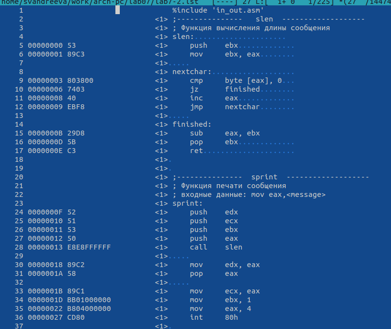{#fig:006 width=70%}

Рассмотрим 24 строку: "00000101 В8 [0A000000]            mov eax,B". Ее адрес "00000101", Машинный код - "В8 [0A000000]", а mov eax,B - исходный текст программы, означающий что в регистр eax мы вносим значения переменной B.
Рассмотрим 38 строку: "00000134 E863FFFFFF           call atoi". Ее адрес "00000134", Машинный код - E863FFFFFF, а call atoi - исходный текст программы, означающий что символ лежащий в строке выше переводится в число.
Рассмотрим 50 строку:"00000162  A1[00000000]             mov eax,[max]". Ее адрес "00000162", Машинный код - A1[00000000], а mov eax,[max] - исходный текст программы, означающий что число хранившееся в переменной max записывается в регистр eax.

Откроем файл с программой lab7-2.asm и в инструкции с двумя операндами удалим один операнд (вместо cmp ecx, [C] оставим cmp ecx)(рис. @fig:007).

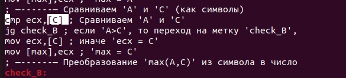{#fig:007 width=70%}

Выполним трансляцию с получением файла листинга.Нам выдало ошибку, так как для программы нужно два операнда(рис. @fig:008).

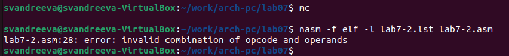{#fig:008 width=70%}

В файле листинга нам показывает где именно ошибка и с чем она связана.(рис. @fig:009) .

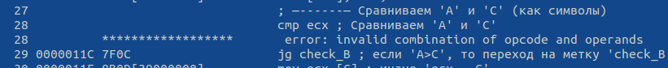{#fig:009 width=70%}

# Задание для самостоятельной работы.

Напишем программу в файле samr12.1.asm для нахождения наименьшей из 3 целочисленных переменных А,В и С (рис. @fig:010).

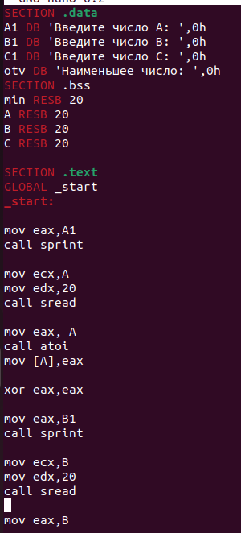{#fig:010 width=70%}

Создадим исполняемый файл и запустим его.Мой вариант 12, поэтому проверим программу для значений 99,29 и 26.Все исполнилось корректно (рис. @fig:011).

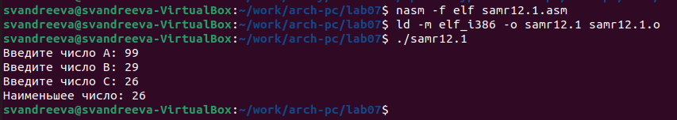{#fig:011 width=70%}

Напишем программу в файле samr12.2.asm, которая для введенных с клавиатуры значений х и а вычисляетзначение заданной функции и выводит результат вычисления.Мой вариант-12.Составим программу для функции f(x)=ах при х < 5 и f(x)= х − 5 при х ≥ 5 (рис. @fig:012).

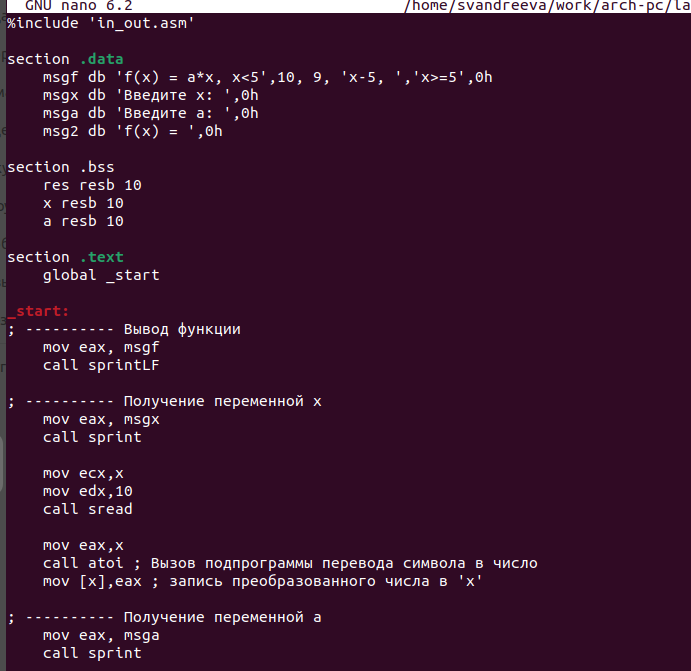{#fig:012 width=70%}
   
Создадим исполняемый файл и запустим его.Проверим его для значений (3;7) и (6;4).Все исполнилось корректно (рис. @fig:013).
 
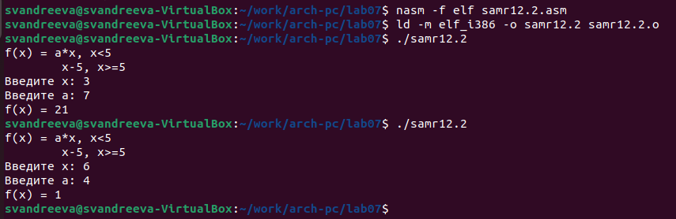{#fig:013 width=70%}
 
# Выводы

Я изучила команды условного и безусловного переходов и приобрела навыки написания программ с использованием переходов, познакомилась с назначением и структурой файла листинга.
