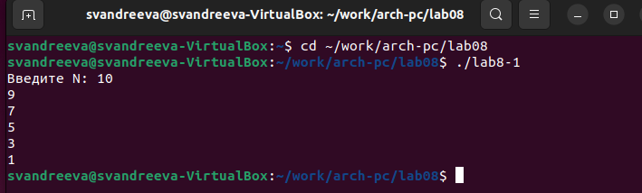

---
## Front matter
title: "Отчёт по лабораторной работе №8"
subtitle: "Архитектура компьютера"
author: "Андреева Софья Владимировна"

## Generic otions
lang: ru-RU
toc-title: "Содержание"

## Bibliography
bibliography: bib/cite.bib
csl: pandoc/csl/gost-r-7-0-5-2008-numeric.csl

## Pdf output format
toc: true # Table of contents
toc-depth: 2
lof: true # List of figures
fontsize: 12pt
linestretch: 1.5
papersize: a4
documentclass: scrreprt
## I18n polyglossia
polyglossia-lang:
  name: russian
  options:
	- spelling=modern
	- babelshorthands=true
polyglossia-otherlangs:
  name: english
## I18n babel
babel-lang: russian
babel-otherlangs: english
## Fonts
mainfont: PT Serif
romanfont: PT Serif
sansfont: PT Sans
monofont: PT Mono
mainfontoptions: Ligatures=TeX
romanfontoptions: Ligatures=TeX
sansfontoptions: Ligatures=TeX,Scale=MatchLowercase
monofontoptions: Scale=MatchLowercase,Scale=0.9
## Biblatex
biblatex: true
biblio-style: "gost-numeric"
biblatexoptions:
  - parentracker=true
  - backend=biber
  - hyperref=auto
  - language=auto
  - autolang=other*
  - citestyle=gost-numeric
## Pandoc-crossref LaTeX customization
figureTitle: "Рис."
tableTitle: "Таблица"
listingTitle: "Листинг"
lofTitle: "Список иллюстраций"
lolTitle: "Листинги"
## Misc options
indent: true
header-includes:
  - \usepackage{indentfirst}
  - \usepackage{float} # keep figures where there are in the text
  - \floatplacement{figure}{H} # keep figures where there are in the text
---

# Цель работы

Приобретение навыков написания программ с использованием циклов и обработкой аргументов командной строки.

# Выполнение лабораторной работы

Создадим каталог для программ лабораторной работы № 8, перейдем в него и создадим файл lab8-1.asm.Внимательно изучим текст программы из листинга 8.1.Введем в файл lab8-1.asm текст программы.Создадим исполняемый файл и запустим его.(рис. @fig:001).

{#fig:001 width=70%}

Изменим текст программы добавив изменение в значение регистра ecx в цикле.Добавим строчку с уменьшением ecx на 1:
```nasm
label:
sub ecx,1 ; `ecx=ecx-1`
mov [N],ecx
mov eax,[N]
call iprintLF
loop label
```
Создадим исполняемый файл и запустим его.В результате в ходе выполнения одной итерации цикла регистр уменьшается на 2, и общее количество итерации становится меньше, при этом в зависимости от ввода N, проверка ecx = 0 может не наступить, что приведет к бесконечному выполнению программы (рис. @fig:002).

{#fig:002 width=70%}

Внесем изменения в текст программы добавив команды push и pop для сохранения значения счетчика цикла loop.Создадим исполняемый файл и проверим его работу.Количество итерации цикла совпадает со значением N.(рис. @fig:003)

{#fig:003 width=70%}

Рассмотрим программу, которая выводит на экран аргументы командной строки. Внимательно изучим текст программы (Листинг 8.2).Создадим файл lab8-2.asm в каталоге ~/work/arch-pc/lab08 и введем в него текст программы из листинга 8.2.Создадим исполняемый файл и запустим его, указав аргументы.Программа обработала 4 аргумента, разделенных пробелами.(рис. @fig:004).

{#fig:004 width=70%}

Рассмотрим еще один пример программы которая выводит сумму чисел, которые передаются в программу как аргументы. Создадим файл lab8-3.asm в каталоге ~/work/archpc/lab08 и введем в него текст программы из листинга 8.3.Создадим исполняемый файл и запустим его.(рис. @fig:005).

{#fig:005 width=70%}

Изменим текст программы из листинга 8.3 для вычисления произведения аргументов командной строки.(рис. @fig:006).
 
{#fig:006 width=70%}

Создадим исполняемый файл и запустим его.Всё получилось,6*5*10*3=900.(рис. @fig:007).

{#fig:007 width=70%}

# Задание для самостоятельной работы.

Для выполнения заданий выбран вариант 12, полученный при выполнении лабораторной работы №6.Напишем программу в файле samr12.asm для нахождения суммы значений функции f(x)=15x-9 (рис. @fig:008).

{#fig:008 width=70%}

Создадим исполняемый файл и запустим его.Проверим вычисления.Все исполнилось корректно (рис. @fig:009).

{#fig:009 width=70%}
 
# Выводы

Я приобрела навыки написания программ с использованием циклов и обработкой аргументов командной строки.
