---
## Front matter
title: "Отчёт по лабораторной работе №9"
subtitle: "Архитектура компьютера"
author: "Андреева Софья Владимировна"

## Generic otions
lang: ru-RU
toc-title: "Содержание"

## Bibliography
bibliography: bib/cite.bib
csl: pandoc/csl/gost-r-7-0-5-2008-numeric.csl

## Pdf output format
toc: true # Table of contents
toc-depth: 2
lof: true # List of figures
fontsize: 12pt
linestretch: 1.5
papersize: a4
documentclass: scrreprt
## I18n polyglossia
polyglossia-lang:
  name: russian
  options:
	- spelling=modern
	- babelshorthands=true
polyglossia-otherlangs:
  name: english
## I18n babel
babel-lang: russian
babel-otherlangs: english
## Fonts
mainfont: PT Serif
romanfont: PT Serif
sansfont: PT Sans
monofont: PT Mono
mainfontoptions: Ligatures=TeX
romanfontoptions: Ligatures=TeX
sansfontoptions: Ligatures=TeX,Scale=MatchLowercase
monofontoptions: Scale=MatchLowercase,Scale=0.9
## Biblatex
biblatex: true
biblio-style: "gost-numeric"
biblatexoptions:
  - parentracker=true
  - backend=biber
  - hyperref=auto
  - language=auto
  - autolang=other*
  - citestyle=gost-numeric
## Pandoc-crossref LaTeX customization
figureTitle: "Рис."
tableTitle: "Таблица"
listingTitle: "Листинг"
lofTitle: "Список иллюстраций"
lolTitle: "Листинги"
## Misc options
indent: true
header-includes:
  - \usepackage{indentfirst}
  - \usepackage{float} # keep figures where there are in the text
  - \floatplacement{figure}{H} # keep figures where there are in the text
---

# Цель работы

Приобретение навыков написания программ с использованием подпрограмм. Знакомство с методами отладки при помощи GDB и его основными возможностями.

# Выполнение лабораторной работы

Создадим каталог для программ лабораторной работы № 9, перейдем в него и создадим файл lab09-1.asm.Введем в файл lab09-1.asm текст программы из листинга 9.1.Создадим исполняемый файл и запустим его(рис. @fig:001).

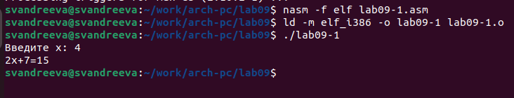{#fig:001 width=70%}

Изменим программу, добавив подпрограмму _subcalcul в подпрограмму _calcul, для вычисления выражения f(g(x)), где x вводится с клавиатуры, f(x)=2x+7, g(x)=3x-1.Переменная x передается в подпрограмму _calcul из нее в подпрограмму _subcalcul, где вычисляется выражение g(x), результат возвращается в _calcul и вычисляется выражение f(g(x)). Результат возвращается в основную программу для вывода результата на экран.(рис. @fig:002).
 
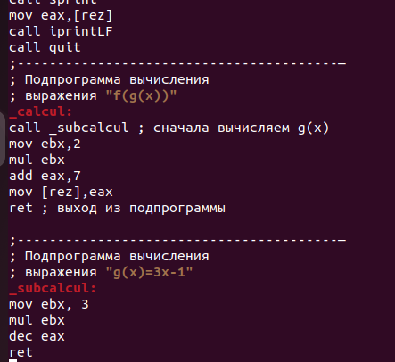{#fig:002 width=70%}

Создадим исполняемый файл и запустим его.Всё получилось (рис. @fig:003).

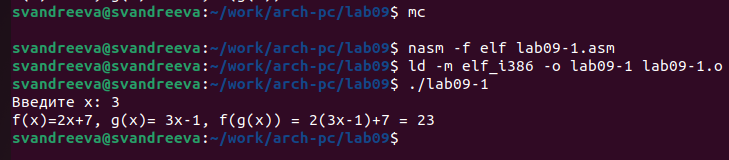{#fig:003 width=70%}

Создадим файл lab09-2.asm и введем в него текст программы из листинга 9.2.Получим исполняемый файл,добавив для работы с GDB отладочную информацию, трансляцию программ проводим с ключом -g.Загрузим исполняемый файл в отладчик gdb и проверим работу программы, запустив ее в оболочке GDB с помощью команды run(рис. @fig:004).

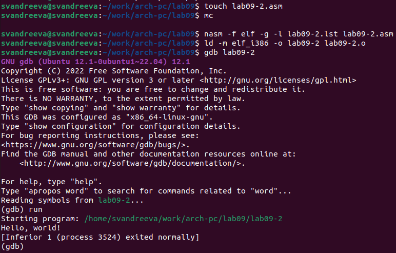{#fig:004 width=70%}

Для более подробного анализа программы установим брейкпоинт на метку _start, с которой начинается выполнение любой ассемблерной программы, и запустим её.(рис. @fig:005).

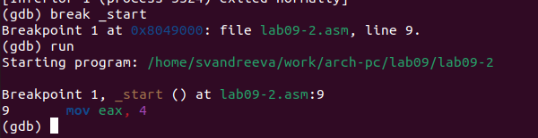{#fig:005 width=70%}

Посмотрим дисассимилированный код программы с помощью команды disassemble начиная с метки _start(рис. @fig:006).
 
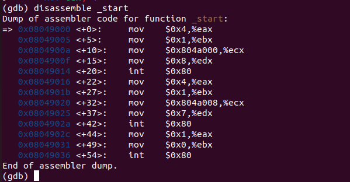{#fig:006 width=70%}

Переключимся на отображение команд с Intel’овским синтаксисом, введя команду set disassembly-flavor intel(рис. @fig:007).

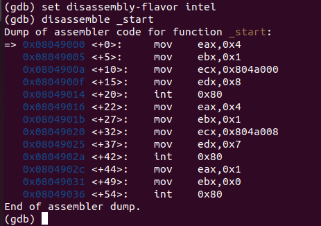{#fig:007 width=70%}

Pазличия отображения синтаксиса машинных команд в режимах ATT и Intel: противоположное расположение операнда-источника и операнда-приемника (в Intel - приемник, источник, а в ATT - источник, приемник); в ATT регистры пишутся после ‘%’, а непосредственные операнды после ‘$’, в синтаксисе Intel операнды никак не помечаются.

Включим режим псевдографики для более удобного анализа программы(рис. @fig:008).

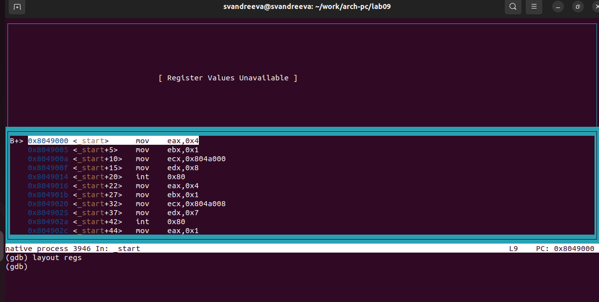{#fig:008 width=70%}

На предыдущих шагах была установлена точка останова по имени метки (_start). Проверим это с помощью команды info breakpoints(рис. @fig:009) .

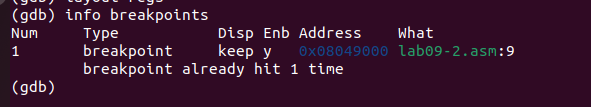{#fig:009 width=70%}

Установим еще одну точку останова по адресу предпоследней инструкции.Посмотрим информацию о всех установленных точках останова(рис. @fig:010).

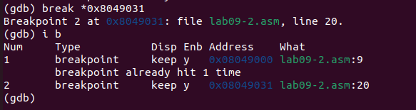{#fig:010 width=70%}

Выполним 5 инструкций с помощью команды stepi и проследим за изменением значений регистров.В результате изменяются значения регистров eax, ebx, ecx, edx (рис. @fig:011).

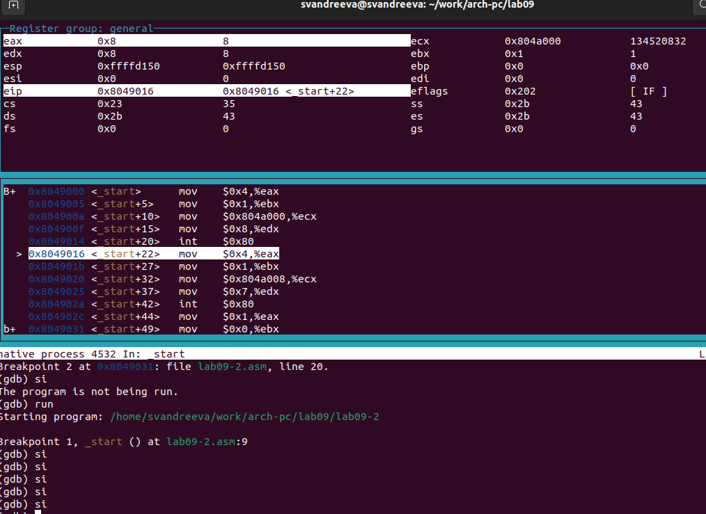{#fig:011 width=70%}

Посмотрели значения переменных msg1 и msg2, причем адрес памяти msg1 задали по имени переменной, а адрес памяти msg2 вписали вручную, взяв его из дисассемблированного кода программы (рис. @fig:012).

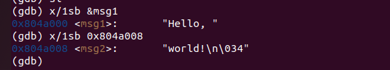{#fig:012 width=70%}

С помощью команды set заменили в msg1 первый символ, в переменной msg2 - второй (рис. @fig:013).

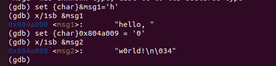{#fig:013 width=70%}

Выведем значения регистра edx в десятичном, шестнадцатеричном и двоичном формате, соответственно (рис. @fig:014).

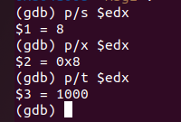{#fig:014 width=70%}

Использовав команду set изменили значение регистра ebx сначала на символ ‘2’, а затем на число 2, и сравнили вывод значения регистра в десятичном формате. В результате присвоения регистра значение символа ‘2’, выводится число 50, что соответствует символу в ‘2’ в таблице ASCII (рис. @fig:015).

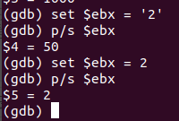{#fig:015 width=70%}

Затем завершили выполнение программы командой continue (сокращенно c), и вышли из GDB по команде quit.

Для примера обработки аргментов командоной строки в GDB скопировали файл lab8-2.asm из Лабораторной работы №8 (программа выводит на экран аргументы командной строки) в файл lab9-3.asm, создали исполняемый файл и запустили в GDB с ключом —args.Установили точку останова перед первой инструкцией в программе и запустили ее (рис. @fig:016).

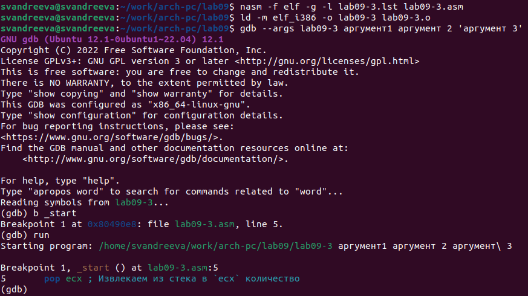{#fig:016 width=70%}

Проверила адрес вершины стека и убедилась что там хранится 5 элементов (рис. @fig:017).

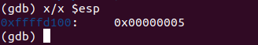{#fig:017 width=70%}

Я посмотрела все позиции стека.В первом хранится адрес, в остальных хранятся элементы. Элементы расположены с интервалом в 4 единицы, так как стек может хранить до 4 байт:каждый элемент стека занимает 4 байта, поэтому для получения следующего элемента стека мы добавляем 4 к адресу вершины (рис. @fig:018).

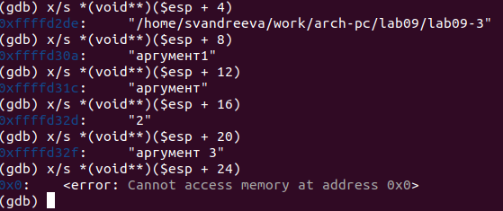{#fig:018 width=70%}

# Задание для самостоятельной работы.

1.Преобразуем программу из лабораторной работы №8 (Задание №1 для самостоятельной работы), реализовав вычисление значения функции 𝑓(𝑥) как подпрограмму.Запустим файл.Все исполнилось корректно(рис. @fig:019).

```nasm
%include 'in_out.asm'

SECTION .data
msg1 db "Функция: f(x)=15*x-9 ",0
msg2 db "Результат: ",0
SECTION .text
global _start

_start:

mov eax, msg1
call sprintLF

pop ecx ; Извлекаем из стека в `ecx` количество
; аргументов (первое значение в стеке)
pop edx ; Извлекаем из стека в `edx` имя программы
; (второе значение в стеке)
sub ecx,1 ; Уменьшаем `ecx` на 1 (количество
; аргументов без названия программы)
mov esi, 0 ; Используем `esi` для хранения
; промежуточных сумм
next:
cmp ecx,0h ; проверяем, есть ли еще аргументы
jz _end ; если аргументов нет выходим из цикла
; (переход на метку `_end`)
pop eax ; иначе извлекаем следующий аргумент из стека
call atoi ; преобразуем символ в число
call _calcul ; вызываем подпрограмму для вычисления f(x)

add esi,eax ; добавляем к промежуточной сумме
; след. аргумент `esi=esi+eax`
loop next ; переход к обработке следующего аргумента
_end:
mov eax, msg2 ; вывод сообщения "Результат: "
call sprint
mov eax, esi ; записываем сумму в регистр `eax`
call iprintLF ; печать результата
call quit ; завершение программы

_calcul: ; подпрограмма для вычисления f(x)=15*x-9
mov ebx, 15
mul ebx
sub eax, 9
ret
```

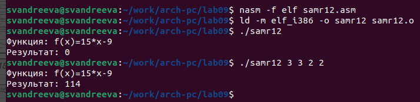{#fig:019 width=70%}

2.Создадим файл с текстом из листинга 9.3, где приведена программа вычисления выражения (3 + 2) ∗ 4 + 5. При запуске данная программа дает неверный результат(рис. @fig:020).

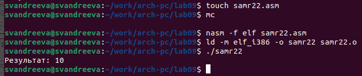{#fig:020 width=70%}

Проанализировали с помощью отладичка GDB изменение значений регистров, чтобы найти ошибку. Установили брейкпоинт b _start, включили режим псевдографики и начали поочердно выполнять команды и следить за значениями регистров. Первая ошибка - результат 3+2=5 записан в регистре ebx (команда add ebx, eax), но команда mul всегда перемножает значение регистра eax с указанным сомножителем, поэтому mul ecx дает неверный результат: (3+2)∗4=5. Затем на убеждении, что регистр ebx содержит корректный результат вычислений, к нему добавляется число 5, результат запоминается в регистре edi, а затем выводится (рис. @fig:021).

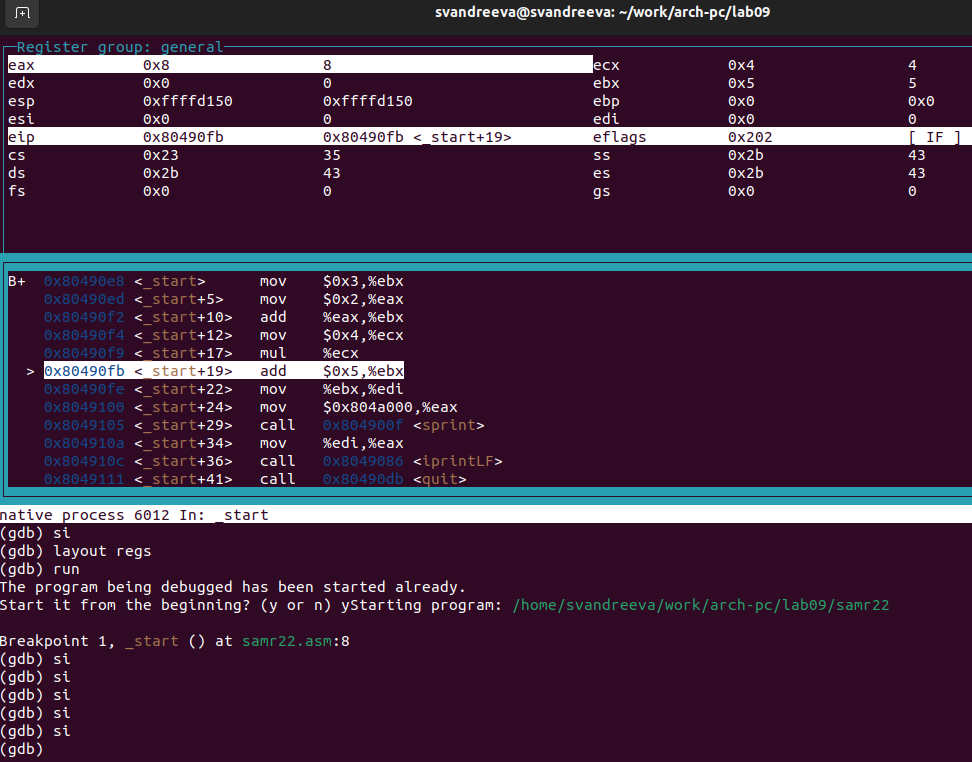{#fig:021 width=70%}
   
Исправим текст программы:
```nasm
%include 'in_out.asm'

SECTION .data
div: DB 'Результат: ',0

SECTION .text
GLOBAL _start

_start:

; —— Вычисление выражения (3+2)*4+5
mov ebx,3
mov eax,2
add eax,ebx
mov ecx,4
mul ecx
add eax,5
mov edi,eax

; —— Вывод результата на экран
mov eax,div
call sprint
mov eax,edi
call iprintLF

call quit
```
 
Запустим файл.Все выполнилось корректно.(рис. @fig:022).
 
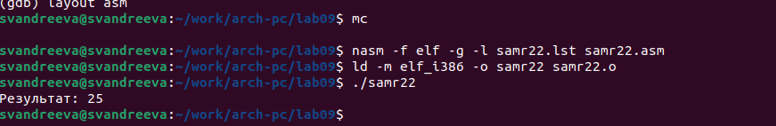{#fig:022 width=70%}
 
# Выводы

Я приобрела навыки написания программ с использованием подпрограмм и познакомилась с методами отладки при помощи GDB и его основными возможностями.
