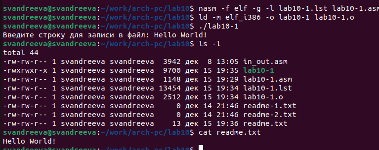
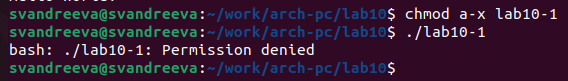
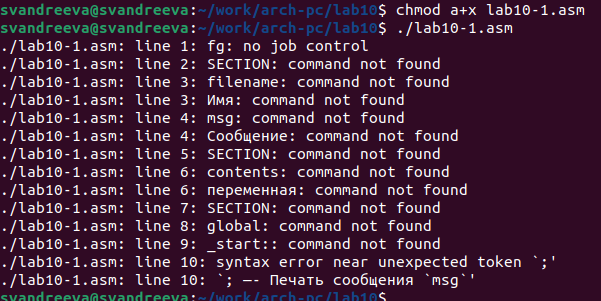
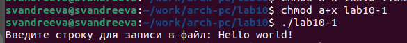
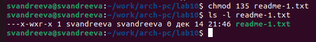
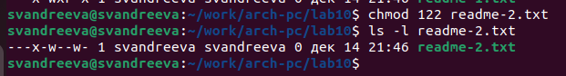
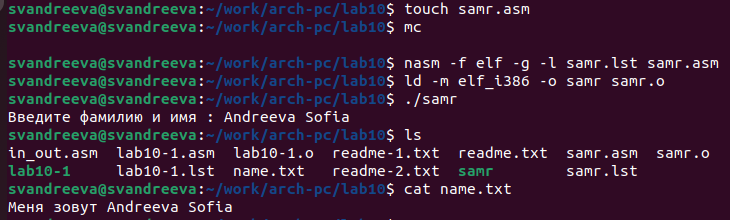

---
## Front matter
title: "Отчёт по лабораторной работе №10"
subtitle: "Архитектура компьютера"
author: "Андреева Софья Владимировна"

## Generic otions
lang: ru-RU
toc-title: "Содержание"

## Bibliography
bibliography: bib/cite.bib
csl: pandoc/csl/gost-r-7-0-5-2008-numeric.csl

## Pdf output format
toc: true # Table of contents
toc-depth: 2
lof: true # List of figures
fontsize: 12pt
linestretch: 1.5
papersize: a4
documentclass: scrreprt
## I18n polyglossia
polyglossia-lang:
  name: russian
  options:
	- spelling=modern
	- babelshorthands=true
polyglossia-otherlangs:
  name: english
## I18n babel
babel-lang: russian
babel-otherlangs: english
## Fonts
mainfont: PT Serif
romanfont: PT Serif
sansfont: PT Sans
monofont: PT Mono
mainfontoptions: Ligatures=TeX
romanfontoptions: Ligatures=TeX
sansfontoptions: Ligatures=TeX,Scale=MatchLowercase
monofontoptions: Scale=MatchLowercase,Scale=0.9
## Biblatex
biblatex: true
biblio-style: "gost-numeric"
biblatexoptions:
  - parentracker=true
  - backend=biber
  - hyperref=auto
  - language=auto
  - autolang=other*
  - citestyle=gost-numeric
## Pandoc-crossref LaTeX customization
figureTitle: "Рис."
tableTitle: "Таблица"
listingTitle: "Листинг"
lofTitle: "Список иллюстраций"
lolTitle: "Листинги"
## Misc options
indent: true
header-includes:
  - \usepackage{indentfirst}
  - \usepackage{float} # keep figures where there are in the text
  - \floatplacement{figure}{H} # keep figures where there are in the text
---

# Цель работы

Приобретение навыков написания программ для работы с файлами.

# Выполнение лабораторной работы

Создадим каталог для программ лабораторной работы № 10, перейдем в него и создадим файлы lab10-1.asm, readme.txt,readme-1.txt и readme-2.txt.Внимательно изучим текст программы из листинга 10.1.Введем в файл lab10-1.asm текст программы.Создадим исполняемый файл и запустим его.(рис. @fig:001).

{#fig:001 width=70%}

С помощью команды chmod изменим права доступа к исполняемому файлу lab10-1,запретив его выполнение.Запускаем файл.В результате видим, что не можем запустить исполняемый файл, так как мы всем закрыли доступ, в том числе владельцу (рис. @fig:002).

{#fig:002 width=70%}

С помощью команды chmod изменим права доступа к файлу lab10-1.asm с исходным текстом программы, добавив права на исполнение.Когда мы разрешим исполнение файла с расширением .asm, и исполним его, то мы увидим множество ошибок, ведь этот файл изначально не имел прав.

{#fig:003 width=70%}

А если помощью команды chmod изменим права доступа к файлу lab10-1 с исходным текстом программы, добавив права на исполнение и выполним его,видим как программа нормально запускается(рис. @fig:004)

{#fig:004 width=70%}

В соответствии с вариантом 12, предоставляем права доступа к файлу readme-1.txt представленные в символьном виде.Hабор --x -wx r-x соответствует набору 135 в восьмеричной системе.Проверяем правильность выполнения с помощью команды ls -l (рис. @fig:005).

{#fig:005 width=70%}

А для файла readme-2.txt – в двочном виде.Hабор 001 010 010 соответствует набору 122 в восьмеричной системе и набору --x -w- -w- в символьном виде.Проверяем правильность выполнения с помощью команды ls -l (рис. @fig:006).

{#fig:006 width=70%}

# Задание для самостоятельной работы.

Напишем программу работающую по данному нам алгоритму:
```nasm
%include 'in_out.asm'
SECTION .data
filename db 'name.txt', 0h ; Имя файла
msg db 'Введите фамилию и имя : ', 0h ; Сообщение
msg2 db 'Меня зовут '
msg2Len EQU $-msg2
SECTION .bss
contents resb 255 ; переменная для вводимой строки
outLine times 255+msg2Len resb 1; строка out имеет длину msg2Len+255
SECTION .text
global _start
_start:
; —- Печать сообщения `msg`
mov eax,msg
call sprint
; —— Запись введеной с клавиатуры строки в `contents`
mov ecx, contents
mov edx, 255
call sread
; —- Объединение двух строк msg2 и contents
mov ecx, msg2Len
mov esi, msg2
mov edi, outLine
cld ; обнуляет флаг направления DF, чтобы адреса увеличивались (слева направо)
rep movsb ; побайтовое копирование из esi в edi, кол-во раз записано в ecx.
mov eax, contents
call slen
mov ecx, eax ; eax содержит длину строки contents
mov esi, contents
mov edi, outLine+msg2Len ; сдвигаем начало копирования на длину msg2
cld
rep movsb
; —- Создание нового файла (`sys_creat`)
mov ecx, 0666o ; установка прав доступа (110 110 110, т.е. без права исполнения)
mov ebx, filename ; имя файла
mov eax, 8 ; номер системного вызова `sys_creat`
int 80h
; —- Открытие существующего файла (`sys_open`)
mov ecx, 2 ; открываем для записи (2)
mov ebx, filename
mov eax, 5
int 80h
; —- Запись дескриптора файла в `esi`
mov esi, eax
; —- Записываем в файл `outLine` (`sys_write`)
mov eax, outLine
call slen
mov edx, eax
mov ecx, outLine
mov ebx, esi
mov eax, 4
int 80h
; —- Закрываем файл (`sys_close`)
mov ebx, esi
mov eax, 6
int 80h
call quit
```

Создали исполняемый файл и проверили его работу. Проверили наличие файла и его содержимое с помощью команд ls и cat (рис. @fig:007).

{#fig:007 width=70%}

# Выводы

Я приобрела навыки написания программ для работы с файлами.
